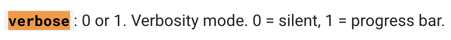
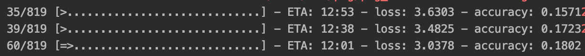

# Animal Recognition in Tensorflow

* This is a general guide with notes on the implementation of Computer Vision applications via Tensorflow and Python, the dataset I am using for the purposes of this project can be found [here](https://www.kaggle.com/alessiocorrado99/animals10#OIP---lAIbDlHKmejDpqrXq6vAAAAA.jpeg).

* I wrote this in Jupyter Notebook to make it easier to take notes and make observations especially when implementing the more complicated Inception Networks, but one thing important to note is that the enviornment that Jupyter runs in does not allow for direct hardware access.
    * An interesting fact about Tensorflow that most people know, is that the core feature of Tensorflow involves the creation of a computation graph which is deployed via C++ in the background to the GPU. Which cannot be done in Jupyter
    * When you see the **.fit** method used anywhere and don't see any output it is for this reason, compile this program on your IDE of choice and run .fit there, Jupyter can't access the GPU

#### Goals of this project:
0. [Image loading from directories](#0.-Image-Loading-from-Directories)
<br/><br/>
1. [Pre-processing and Data Augmentation](#1.-Pre-processing-and-Data-Augmentation)
<br/><br/>
2. [Experiment with ILSVRC pre-trained models](#2.-Experiment-with-ILSVRC-pre-trained-models)
<br/><br/>
3. [Experiment with custom model development](#3.-Experiment-with-custom-model-development)
    * Different optimizers
    * loss functions
    * callbacks
<br/><br/>
4. Exporting the model 
    * TF-Slim
    * h5
    * Tensorflow Model Save/Load procedure


```python
directory = 'animals' # Directory of the animal images
animals = ['cat', 'butterfly', 'dog', 'sheep', 'spider', 'chicken', 'horse', 'squirrel', 'cow', 'elephant']
num_classes = len(animals)

# Tensorflow version I plan on using for this project
import tensorflow as tf
print(tf.__version__)
```

    2.1.0


## 0. Image Loading from Directories

### Loading Images using Pillow


```python
from PIL import Image
import IPython.display as display
import os

file_paths = [] # file_paths for targets
targets = [] # targets

# Parse animal folder and set file_path and targets arrays
for animal in animals:
    animal_dir = os.path.join(directory,animal)
    for file in os.listdir(animal_dir):
        file_paths.append(os.path.join(animal_dir, file))
        targets.append(animals.index(animal))

print('Picture of', animals[targets[0]])
display.display(Image.open(file_paths[0]))
```

    Picture of cat


* This is great, but it was a lot of work to do all of this manually, Keras and Tensorflow make it easy

### Loading Images using Keras
* Keras comes with the ability to load images and the Tensorflow website [here](https://www.tensorflow.org/tutorials/load_data/images) has a bunch of great examples on implementation


```python
import tensorflow as tf

import numpy as np
# The 1./255 is to convert from uint8 to float32 in range [0,1]
img_gen = tf.keras.preprocessing.image.ImageDataGenerator(rescale=1./255)

image_count = len(file_paths)
BATCH_SIZE = 32 # 32 for visualization, but 256 is typical for large scale image applications
IMG_HEIGHT = 224
IMG_WIDTH = 224
STEPS_PER_EPOCH = np.ceil(image_count/BATCH_SIZE)

train_data_gen = img_gen.flow_from_directory(directory=str(directory), 
                                             follow_links=True,
                                                     batch_size=BATCH_SIZE,
                                                     shuffle=True,
                                                     target_size=(IMG_HEIGHT, IMG_WIDTH),
                                                     classes = (animals))
```

    Found 26179 images belonging to 10 classes.


The code above is pretty straightforward, the keras ImageDataGenerator utility provides an easy way to rescale and load images from paths. However one thing I do want to note is a very useful feature for directories with hierarchies.

In the event that you have folders within folders containing images, i.e: animals/cats/... and animals/dogs/..., you want to pay attention to:

**follow_links = True**

By default this is False, but setting it to True allows the DataGenerator to automatically loop through each individual directory according to the classes list


```python
import matplotlib.pyplot as plt

# You need to turn the classes into a numpy array
animal_np = np.array(animals)

def show_batch(image_batch, label_batch):
  plt.figure(figsize=(10,10))
  for n in range(25):
      ax = plt.subplot(5,5,n+1)
      plt.imshow(image_batch[n])
      plt.title(animal_np[label_batch[n]==1][0].title())
      plt.axis('off')

image_batch, label_batch = next(train_data_gen)
show_batch(image_batch, label_batch)
```

This method through Keras is great, but has a ton of problems:
1. Slow
2. No fine-grain control
3. Not integrated with TF directly (harder to troubleshoot when plugging into ConvNet)

### Loading images using tf.data


```python
list_ds = tf.data.Dataset.list_files(str(directory + '/*/*')) # /*/* go down to the files
for f in list_ds.take(5):
  print(f.numpy())
```

    b'animals/chicken/925.jpeg'
    b'animals/spider/OIP-YwIeC2PA80im2Y8TsIuCGwHaFd.jpeg'
    b'animals/cat/133.jpeg'
    b'animals/elephant/eb3cb20628f1053ed1584d05fb1d4e9fe777ead218ac104497f5c978a4eebdbd_640.jpg'
    b'animals/cat/ea36b5062bf5013ed1584d05fb1d4e9fe777ead218ac104497f5c978a7e8b7bc_640.jpg'


```python
def decode_img(img):
  # convert the raw string into a 3d tensor
  img = tf.image.decode_jpeg(img, channels=3)
  # Use `convert_image_dtype` to convert to floats in the [0,1] range.
  img = tf.image.convert_image_dtype(img, tf.float32)
  # resize the image to the desired size.
  return tf.image.resize(img, [IMG_WIDTH, IMG_HEIGHT])

def get_label_image_pair(file_path):
    
    # Find the class name -----------------------------
    segments = tf.strings.split(file_path, os.path.sep)
    # The second to last is the directory name
    tensor = [0, 1, 2, 3, 4, 5, 6, 7, 8, 9]
    mask = segments[-2] == animals
    label = tf.boolean_mask(tensor, mask) # CONVERT TO ONE-HOT
    
    # Get the image in raw format ---------------------
    img = tf.io.read_file(file_path)
    img = decode_img(img)
    return img, label

labeled_ds = list_ds.map(get_label_image_pair) #num_parallel_calls=tf.data.experimental.AUTOTUNE)

labeled_ds = labeled_ds.shuffle(buffer_size=1000).batch(32)
    
for image, label in labeled_ds.take(1):
    print("Image shape: ", image.numpy().shape)
    print("Label: ", len(label.numpy()), label.dtype)
```

    Image shape:  (32, 224, 224, 3)
    Label:  32 <dtype: 'int32'>


I'll be using the tensorflow.data method of loading images in order to make the process of image augmentation easier

## 1. Pre-processing and Data Augmentation
* This still needs to be completed

## 2. Experiment with ILSVRC pre-trained models
* Now we have a completed dataset, the next step is to mess around with some of the basic models from the ImageNet Large Scale Visual Recognition Challenge, a competition that standardized basic CV models for use in the industry. It ran until the models produced achieved accuracy better than a human.

Loading the ILSVRC models in Tensorflow has been made really easy with the model downloading features introduced to TF. 

* The goals of this section of the project are as follows:
    * Download multiple popular ILSVRC models
    * Experiment with fitting the data
    * Experiment with different compilers and loss functions + trade-offs
    * Analyze model architecture
    
### Downloading the models
#### VGG - Visual Geometry Group @ Oxford (2014 2nd place)
* Made use of **ReLU** (Rectified Linear Unit) as activation function common in CNNs for adding non-linearity
* Applied **dropout** to CNN architecture
* Standardized structure of CNN layers --> Dense (Fully-Connected) layers


```python
vgg_net = tf.keras.applications.VGG16(
    include_top = True, weights=None, # you can set weights to 'imagenet'
    input_tensor=None, input_shape = None, pooling = None, 
    classes = 10 # 1000 for imagenet weights
)

vgg_net.compile(optimizer='adam',
              loss=tf.keras.losses.SparseCategoricalCrossentropy(), 
              metrics=['accuracy'])
```


```python
print(vgg_net.summary())
```

    Model: "vgg16"
    _________________________________________________________________
    Layer (type)                 Output Shape              Param #   
    =================================================================
    input_1 (InputLayer)         [(None, 224, 224, 3)]     0         
    _________________________________________________________________
    block1_conv1 (Conv2D)        (None, 224, 224, 64)      1792      
    _________________________________________________________________
    block1_conv2 (Conv2D)        (None, 224, 224, 64)      36928     
    _________________________________________________________________
    block1_pool (MaxPooling2D)   (None, 112, 112, 64)      0         
    _________________________________________________________________
    block2_conv1 (Conv2D)        (None, 112, 112, 128)     73856     
    _________________________________________________________________
    block2_conv2 (Conv2D)        (None, 112, 112, 128)     147584    
    _________________________________________________________________
    block2_pool (MaxPooling2D)   (None, 56, 56, 128)       0         
    _________________________________________________________________
    block3_conv1 (Conv2D)        (None, 56, 56, 256)       295168    
    _________________________________________________________________
    block3_conv2 (Conv2D)        (None, 56, 56, 256)       590080    
    _________________________________________________________________
    block3_conv3 (Conv2D)        (None, 56, 56, 256)       590080    
    _________________________________________________________________
    block3_pool (MaxPooling2D)   (None, 28, 28, 256)       0         
    _________________________________________________________________
    block4_conv1 (Conv2D)        (None, 28, 28, 512)       1180160   
    _________________________________________________________________
    block4_conv2 (Conv2D)        (None, 28, 28, 512)       2359808   
    _________________________________________________________________
    block4_conv3 (Conv2D)        (None, 28, 28, 512)       2359808   
    _________________________________________________________________
    block4_pool (MaxPooling2D)   (None, 14, 14, 512)       0         
    _________________________________________________________________
    block5_conv1 (Conv2D)        (None, 14, 14, 512)       2359808   
    _________________________________________________________________
    block5_conv2 (Conv2D)        (None, 14, 14, 512)       2359808   
    _________________________________________________________________
    block5_conv3 (Conv2D)        (None, 14, 14, 512)       2359808   
    _________________________________________________________________
    block5_pool (MaxPooling2D)   (None, 7, 7, 512)         0         
    _________________________________________________________________
    flatten (Flatten)            (None, 25088)             0         
    _________________________________________________________________
    fc1 (Dense)                  (None, 4096)              102764544 
    _________________________________________________________________
    fc2 (Dense)                  (None, 4096)              16781312  
    _________________________________________________________________
    predictions (Dense)          (None, 10)                40970     
    =================================================================
    Total params: 134,301,514
    Trainable params: 134,301,514
    Non-trainable params: 0
    _________________________________________________________________
    None


```python
# vgg_net.fit(labeled_ds, epochs=200, verbose=1)
```

## 3. Experiment with custom model development
* Goals in this portion of the project
    * [Different optimizers](#Optimizers)
    * loss functions
    * callbacks


```python
from tensorflow.keras.models import Sequential, Model
from tensorflow.keras.layers import Dense, Conv2D, MaxPooling2D, Flatten, Input
input_shape = (224, 224, 3)
model = Sequential()
model.add(Conv2D(32, kernel_size=(5,5), input_shape=input_shape))
model.add(MaxPooling2D(pool_size=(2,2)))
model.add(Conv2D(32, kernel_size=(3,3), input_shape=input_shape))
model.add(Conv2D(32, kernel_size=(1,1), input_shape=input_shape))
model.add(MaxPooling2D(pool_size=(2,2)))
model.add(Conv2D(32, kernel_size=(3,3), input_shape=input_shape))
model.add(Conv2D(32, kernel_size=(1,1), input_shape=input_shape))
model.add(MaxPooling2D(pool_size=(4,4)))
model.add(Flatten())
model.add(Dense(128, activation='relu'))
model.add(Dense(68, activation='relu'))
model.add(Dense(10, activation='softmax'))

model.compile(optimizer='adam',
              loss=tf.keras.losses.SparseCategoricalCrossentropy(), 
              metrics=['accuracy'])
```


```python
for image, label in labeled_ds.take(1):
    print("Image shape: ", image.numpy().shape)
    print("Label: ", len(label.numpy()), label.dtype)
```

    Image shape:  (32, 224, 224, 3)
    Label:  32 <dtype: 'int32'>


```python
#model.fit(labeled_ds, epochs=2, verbose=1)
# You can run this on your computer
print(model.summary())
```

    Model: "sequential_2"
    _________________________________________________________________
    Layer (type)                 Output Shape              Param #   
    =================================================================
    conv2d_6 (Conv2D)            (None, 220, 220, 32)      2432      
    _________________________________________________________________
    max_pooling2d_4 (MaxPooling2 (None, 110, 110, 32)      0         
    _________________________________________________________________
    conv2d_7 (Conv2D)            (None, 108, 108, 32)      9248      
    _________________________________________________________________
    conv2d_8 (Conv2D)            (None, 108, 108, 32)      1056      
    _________________________________________________________________
    max_pooling2d_5 (MaxPooling2 (None, 54, 54, 32)        0         
    _________________________________________________________________
    conv2d_9 (Conv2D)            (None, 52, 52, 32)        9248      
    _________________________________________________________________
    conv2d_10 (Conv2D)           (None, 52, 52, 32)        1056      
    _________________________________________________________________
    max_pooling2d_6 (MaxPooling2 (None, 13, 13, 32)        0         
    _________________________________________________________________
    flatten_2 (Flatten)          (None, 5408)              0         
    _________________________________________________________________
    dense_6 (Dense)              (None, 128)               692352    
    _________________________________________________________________
    dense_7 (Dense)              (None, 68)                8772      
    _________________________________________________________________
    dense_8 (Dense)              (None, 10)                690       
    =================================================================
    Total params: 724,854
    Trainable params: 724,854
    Non-trainable params: 0
    _________________________________________________________________
    None



* Here is an example of the training view, I can't complete training on my MacBookPro without risking overheating, but I began training to get an idea of how the process works for a dataset of this size


### Optimizers
* As we all learned in Data Science, Optimizers are a critical part of any adaptive algorithm, there are a few common Optimizers used in Computer Vision that can enable us to develop better applications, namely:
    * 


```python

```
