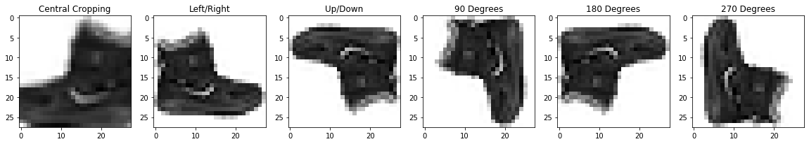

# Animal Recognition in Tensorflow

* This is a general guide with notes on the implementation of Computer Vision applications via Tensorflow and Python, the dataset I am using for the purposes of this project can be found [here](https://www.kaggle.com/alessiocorrado99/animals10#OIP---lAIbDlHKmejDpqrXq6vAAAAA.jpeg).

* I wrote this in Jupyter Notebook to make it easier to take notes and make observations especially when implementing the more complicated Inception Networks, but one thing important to note is that the enviornment that Jupyter runs in does not allow for direct hardware access.
    * An interesting fact about Tensorflow that most people know, is that the core feature of Tensorflow involves the creation of a computation graph which is deployed via C++ in the background to the GPU. Which cannot be done in Jupyter
    * When you see the **.fit** method used anywhere and don't see any output it is for this reason, compile this program on your IDE of choice and run .fit there, Jupyter can't access the GPU --> It can actually access the GPU if you install tensorflow-gpu, but will run poorly on a Mac.

#### Goals of this project:
0. [Image loading from directories](#0.-Image-Loading-from-Directories)
<br/><br/>
1. [Pre-processing and Data Augmentation](#1.-Pre-processing-and-Data-Augmentation)
<br/><br/>
2. [Experiment with ILSVRC pre-trained models](#2.-Experiment-with-ILSVRC-pre-trained-models)
<br/><br/>
3. [Experiment with custom model development](#3.-Experiment-with-custom-model-development)
    * Different optimizers
    * loss functions
    * callbacks
<br/><br/>
4. [Tensorboard](#4.-Tensorboard)
    * What is it? How does it work? Why use it?
<br/><br/>
5. [Exporting a model](#5.-Exporting-a-model)
    * TF-Slim
    * h5
    * Tensorflow Model Save/Load procedure


```python
directory = 'animals' # Directory of the animal images
animals = ['cat', 'butterfly', 'dog', 'sheep', 'spider', 'chicken', 'horse', 'squirrel', 'cow', 'elephant']
num_classes = len(animals)

# Tensorflow version I plan on using for this project
import tensorflow as tf
print(tf.__version__)
```

    2.1.0


## 0. Image Loading from Directories

### Loading Images using Pillow


```python
from PIL import Image
import IPython.display as display
import os

file_paths = [] # file_paths for targets
targets = [] # targets

# Parse animal folder and set file_path and targets arrays
for animal in animals:
    animal_dir = os.path.join(directory,animal)
    for file in os.listdir(animal_dir):
        file_paths.append(os.path.join(animal_dir, file))
        targets.append(animals.index(animal))

print('Picture of', animals[targets[0]])
display.display(Image.open(file_paths[0]))
```

    Picture of cat


* This is great, but it was a lot of work to do all of this manually, Keras and Tensorflow make it easy

### Loading Images using Keras
* Keras comes with the ability to load images and the Tensorflow website [here](https://www.tensorflow.org/tutorials/load_data/images) has a bunch of great examples on implementation


```python
import tensorflow as tf

import numpy as np
# The 1./255 is to convert from uint8 to float32 in range [0,1]
img_gen = tf.keras.preprocessing.image.ImageDataGenerator(rescale=1./255)

image_count = len(file_paths)
BATCH_SIZE = 32 # 32 for visualization, but 256 is typical for large scale image applications
IMG_HEIGHT = 224
IMG_WIDTH = 224
STEPS_PER_EPOCH = np.ceil(image_count/BATCH_SIZE)

train_data_gen = img_gen.flow_from_directory(directory=str(directory), 
                                             follow_links=True,
                                                     batch_size=BATCH_SIZE,
                                                     shuffle=True,
                                                     target_size=(IMG_HEIGHT, IMG_WIDTH),
                                                     classes = (animals))
```

    Found 26179 images belonging to 10 classes.


The code above is pretty straightforward, the keras ImageDataGenerator utility provides an easy way to rescale and load images from paths. However one thing I do want to note is a very useful feature for directories with hierarchies.

In the event that you have folders within folders containing images, i.e: animals/cats/... and animals/dogs/..., you want to pay attention to:

**follow_links = True**

By default this is False, but setting it to True allows the DataGenerator to automatically loop through each individual directory according to the classes list


```python
import matplotlib.pyplot as plt

# You need to turn the classes into a numpy array
animal_np = np.array(animals)

def show_batch(image_batch, label_batch):
  plt.figure(figsize=(10,10))
  for n in range(25):
      ax = plt.subplot(5,5,n+1)
      plt.imshow(image_batch[n])
      plt.title(animal_np[label_batch[n]==1][0].title())
      plt.axis('off')

image_batch, label_batch = next(train_data_gen)
show_batch(image_batch, label_batch)
```

This method through Keras is great, but has a ton of problems:
1. Slow
2. No fine-grain control
3. Not integrated with TF directly (harder to troubleshoot when plugging into ConvNet)

### Loading images using tf.data


```python
list_ds = tf.data.Dataset.list_files(str(directory + '/*/*')) # /*/* go down to the files
for f in list_ds.take(5):
  print(f.numpy())
```

    b'animals/cat/287.jpeg'
    b'animals/chicken/OIP-93ZdgDE_h_SoeFcQmTU9rgHaFg.jpeg'
    b'animals/horse/OIP-3H-2tSYH9Ip5z5KQqRG9lAHaLH.jpeg'
    b'animals/dog/OIP-IDTZG94vfrKm_xxqofkIvAHaEN.jpeg'
    b'animals/spider/OIP-T6qc_VtP6VSpgDg8l08QUwHaF7.jpeg'


```python
def decode_img(img):
  # convert the raw string into a 3d tensor
  img = tf.image.decode_jpeg(img, channels=3)
  # Use `convert_image_dtype` to convert to floats in the [0,1] range.
  img = tf.image.convert_image_dtype(img, tf.float32)
  # resize the image to the desired size.
  return tf.image.resize(img, [IMG_WIDTH, IMG_HEIGHT])

def get_label_image_pair(file_path):
    
    # Find the class name -----------------------------
    segments = tf.strings.split(file_path, os.path.sep)
    # The second to last is the directory name
    tensor = [0, 1, 2, 3, 4, 5, 6, 7, 8, 9]
    mask = segments[-2] == animals
    label = tf.boolean_mask(tensor, mask) # CONVERT TO ONE-HOT
    
    # Get the image in raw format ---------------------
    img = tf.io.read_file(file_path)
    img = decode_img(img)
    return img, label

labeled_ds = list_ds.map(get_label_image_pair) #num_parallel_calls=tf.data.experimental.AUTOTUNE)

labeled_ds = labeled_ds.shuffle(buffer_size=1000).batch(32)
    
for image, label in labeled_ds.take(1):
    print("Image shape: ", image.numpy().shape)
    print("Label: ", len(label.numpy()), label.dtype)
```

    Image shape:  (32, 224, 224, 3)
    Label:  32 <dtype: 'int32'>


I'll be using the tensorflow.data method of loading images in order to make the process of image augmentation easier

### Constructing a dataset from python lists
* In order to simplify development, I will be using the MNIST recognition dataset in python which can be swapped out for the appropriate dataset in production.


```python
from tensorflow import keras
import tensorflow as tf

# Use the fashion dataset
fashion_mnist = keras.datasets.fashion_mnist

# Get the images and labels from keras
(train_images, train_labels), (test_images, test_labels) = fashion_mnist.load_data()

# In order to input the mnist images, you need to reshape the training data (look below for more info)
train_images = train_images.reshape(-1,28, 28, 1)

# Create a dataset from the appropriate data
x = tf.data.Dataset.from_tensor_slices(train_images)
y = tf.data.Dataset.from_tensor_slices(train_labels)

# Zip the dataset together (creating an x and y)
mnist_dataset = tf.data.Dataset.zip((x, y))
# Shuffle the data and put it into batches
mnist_dataset = mnist_dataset.shuffle(buffer_size=1000).batch(32)
```

* One thing that might not be clear here is why you need to reshape the image data:
    * The first (-1) identifies the image index in the batch while the last (1) is to add a bias value for training and predictions

## 1. Pre-processing and Data Augmentation

* Data Augmentation is key in machine learning projects in order to **reduce overfitting** and help the system make accurate predictions
* This also greatly reduces the amount of data required to train the system
    * Instead of getting more images of a cat for example, reduce scales, alter the color, or rotate an original image to generate variants that can improve the quality of your model
* Tensorflow makes this process easy using [tf.image](https://www.tensorflow.org/api_docs/python/tf/image) with has a ton of methods, some of which I will demo here


```python
import tensorflow as tf

test_image = train_images[0] # Set a test image for testing the transformations

transform_names = [] # Storing the name of the transformations
transform_images = [] # Storing the images
```


```python
# Central Cropping -----------------------------------------------------------------
image = tf.image.central_crop(test_image, central_fraction=0.77)

resized = tf.image.resize(image,[28,28]) # Resize the image to the original dimensions
transform_images.append(resized)
transform_names.append("Central Cropping")

# Flip an Image -----------------------------------------------------------------
image = tf.image.flip_left_right(test_image)
image1 = tf.image.flip_up_down(test_image)
transform_images.append(tf.image.resize(image,[28,28]))
transform_images.append(tf.image.resize(image1,[28,28]))
transform_names.append("Left/Right")
transform_names.append("Up/Down")

# Rotate an Image -----------------------------------------------------------------
image = tf.image.rot90(test_image, k=1)
image1 = tf.image.rot90(test_image, k=2)
image2 = tf.image.rot90(test_image, k=3)
transform_images.append(tf.image.resize(image,[28,28]))
transform_images.append(tf.image.resize(image1,[28,28]))
transform_images.append(tf.image.resize(image2,[28,28]))
transform_names.append("90 Degrees")
transform_names.append("180 Degrees")
transform_names.append("270 Degrees")
```

Now that we have performed the transformations on the images, we can display all the images in a batch view and see a visualization of the transformations


```python
import matplotlib.pyplot as plt

func, axisarray = plt.subplots(1,6, figsize=(20,10))

for i in range(0, len(transform_images)):
    image = tf.reshape(transform_images[i],[28,28]) # Reshape to a 2-d Tensor in order to display
    label = transform_names[i]
    axisarray[i].set_title(label)
    axisarray[i].imshow(image, cmap=plt.cm.binary)
plt.show()
```





* All useful functions in [tf.image](https://www.tensorflow.org/api_docs/python/tf/image):
    * **random_flip_left_right(image)**
    * **random_flip_up_down(image)**
    * **random_hue(image, )**
    * **flip_left_right(image)**
    * **adjust_brightness(image, delta)** delta:[0,1]
    * **adjust_contrast(image, delta)** delta:contrast factor
    * **adjust_gamma** --> Brightness on image
    * **crop_and_resize**
    * **flip_up_down**
    * **random_brightness**
    * **random_contrast**
    * **random_crop**
    * **rot90(image, k)** k:number of 90 degree rotations COUNTERCLOCKWISE

## 2. Experiment with ILSVRC pre-trained models
* Now we have a completed dataset, the next step is to mess around with some of the basic models from the ImageNet Large Scale Visual Recognition Challenge, a competition that standardized basic CV models for use in the industry. It ran until the models produced achieved accuracy better than a human.

Loading the ILSVRC models in Tensorflow has been made really easy with the model downloading features introduced to TF. 

* The goals of this section of the project are as follows:
    * Download multiple popular ILSVRC models
    * Experiment with fitting the data
    * Experiment with different compilers and loss functions + trade-offs
    * Analyze model architecture
    
### Downloading the models
#### VGG - Visual Geometry Group @ Oxford (2014 2nd place)
* Made use of **ReLU** (Rectified Linear Unit) as activation function common in CNNs for adding non-linearity
* Applied **dropout** to CNN architecture
* Standardized structure of CNN layers --> Dense (Fully-Connected) layers


```python
vgg_net = tf.keras.applications.VGG16(
    include_top = True, weights=None, # you can set weights to 'imagenet'
    input_tensor=None, input_shape = None, pooling = None, 
    classes = 10 # 1000 for imagenet weights
)

vgg_net.compile(optimizer='adam',
              loss=tf.keras.losses.SparseCategoricalCrossentropy(), 
              metrics=['accuracy'])
```


```python
print(vgg_net.summary())
```

    Model: "vgg16"
    _________________________________________________________________
    Layer (type)                 Output Shape              Param #   
    =================================================================
    input_1 (InputLayer)         [(None, 224, 224, 3)]     0         
    _________________________________________________________________
    block1_conv1 (Conv2D)        (None, 224, 224, 64)      1792      
    _________________________________________________________________
    block1_conv2 (Conv2D)        (None, 224, 224, 64)      36928     
    _________________________________________________________________
    block1_pool (MaxPooling2D)   (None, 112, 112, 64)      0         
    _________________________________________________________________
    block2_conv1 (Conv2D)        (None, 112, 112, 128)     73856     
    _________________________________________________________________
    block2_conv2 (Conv2D)        (None, 112, 112, 128)     147584    
    _________________________________________________________________
    block2_pool (MaxPooling2D)   (None, 56, 56, 128)       0         
    _________________________________________________________________
    block3_conv1 (Conv2D)        (None, 56, 56, 256)       295168    
    _________________________________________________________________
    block3_conv2 (Conv2D)        (None, 56, 56, 256)       590080    
    _________________________________________________________________
    block3_conv3 (Conv2D)        (None, 56, 56, 256)       590080    
    _________________________________________________________________
    block3_pool (MaxPooling2D)   (None, 28, 28, 256)       0         
    _________________________________________________________________
    block4_conv1 (Conv2D)        (None, 28, 28, 512)       1180160   
    _________________________________________________________________
    block4_conv2 (Conv2D)        (None, 28, 28, 512)       2359808   
    _________________________________________________________________
    block4_conv3 (Conv2D)        (None, 28, 28, 512)       2359808   
    _________________________________________________________________
    block4_pool (MaxPooling2D)   (None, 14, 14, 512)       0         
    _________________________________________________________________
    block5_conv1 (Conv2D)        (None, 14, 14, 512)       2359808   
    _________________________________________________________________
    block5_conv2 (Conv2D)        (None, 14, 14, 512)       2359808   
    _________________________________________________________________
    block5_conv3 (Conv2D)        (None, 14, 14, 512)       2359808   
    _________________________________________________________________
    block5_pool (MaxPooling2D)   (None, 7, 7, 512)         0         
    _________________________________________________________________
    flatten (Flatten)            (None, 25088)             0         
    _________________________________________________________________
    fc1 (Dense)                  (None, 4096)              102764544 
    _________________________________________________________________
    fc2 (Dense)                  (None, 4096)              16781312  
    _________________________________________________________________
    predictions (Dense)          (None, 10)                40970     
    =================================================================
    Total params: 134,301,514
    Trainable params: 134,301,514
    Non-trainable params: 0
    _________________________________________________________________
    None


```python
# vgg_net.fit(labeled_ds, epochs=200, verbose=1)
```

## 3. Experiment with custom model development
* For the purposes of simplifying development of the model and having the ability to finish training in a reasonable time on my computer, I will use the MNIST dataset that was created above. The Animal dataset can be run in the python file located in the PyCharm directory on your own computer with the model of your choice.

* Goals in this portion of the project
    * [Different optimizers](#Optimizers)
    * loss functions
    * callbacks


```python
from tensorflow.keras.models import Sequential, Model
from tensorflow.keras.layers import Dense, Conv2D, MaxPooling2D, Flatten, Input

input_shape = (28,28,1) # Input shape is taken from the MNIST dataset, alter it for animal images
model = Sequential()
model.add(Conv2D(32, kernel_size=(5,5), input_shape=input_shape))
model.add(Conv2D(32, kernel_size=(3,3), input_shape=input_shape))
model.add(Conv2D(32, kernel_size=(1,1), input_shape=input_shape))
model.add(MaxPooling2D(pool_size=(2,2)))
model.add(Conv2D(32, kernel_size=(3,3), input_shape=input_shape))
model.add(Conv2D(32, kernel_size=(1,1), input_shape=input_shape))
model.add(MaxPooling2D(pool_size=(2,2)))
model.add(Flatten())
model.add(Dense(128, activation='relu'))
model.add(Dense(68, activation='relu'))
model.add(Dense(10, activation='softmax'))

model.compile(optimizer='adam',
              loss=tf.keras.losses.SparseCategoricalCrossentropy(), 
              metrics=['accuracy'])

```


```python
for image, label in mnist_dataset.take(1):
    print("Image shape: ", image.numpy().shape, ' --> (batch_size, image_size[0], image_size[1], bias_size})')
    print("Label: ", label.numpy(), label.dtype)
```

    Image shape:  (32, 28, 28, 1)  --> (batch_size, image_size[0], image_size[1], bias_size})
    Label:  [9 5 8 8 5 2 9 0 7 3 1 4 3 3 5 6 9 2 7 6 9 6 9 6 2 7 9 5 0 3 5 3] <dtype: 'uint8'>


* Now we can fit the model to our data


```python
model.fit(mnist_dataset, epochs=5, verbose=1)
```

    Train for 1875 steps
    Epoch 1/5
    1875/1875 [==============================] - 63s 33ms/step - loss: 0.3862 - accuracy: 0.8621
    Epoch 2/5
    1875/1875 [==============================] - 59s 31ms/step - loss: 0.3646 - accuracy: 0.8701
    Epoch 3/5
    1875/1875 [==============================] - 226s 121ms/step - loss: 0.3374 - accuracy: 0.8790
    Epoch 4/5
    1875/1875 [==============================] - 70s 37ms/step - loss: 0.3185 - accuracy: 0.8845
    Epoch 5/5
    1875/1875 [==============================] - 69s 37ms/step - loss: 0.3057 - accuracy: 0.8889


    <tensorflow.python.keras.callbacks.History at 0x102f92dd0>


```python
print(model.summary()) # We can get a description of the model after training
```

    Model: "sequential"
    _________________________________________________________________
    Layer (type)                 Output Shape              Param #   
    =================================================================
    conv2d (Conv2D)              (None, 24, 24, 32)        832       
    _________________________________________________________________
    conv2d_1 (Conv2D)            (None, 22, 22, 32)        9248      
    _________________________________________________________________
    conv2d_2 (Conv2D)            (None, 22, 22, 32)        1056      
    _________________________________________________________________
    max_pooling2d (MaxPooling2D) (None, 11, 11, 32)        0         
    _________________________________________________________________
    conv2d_3 (Conv2D)            (None, 9, 9, 32)          9248      
    _________________________________________________________________
    conv2d_4 (Conv2D)            (None, 9, 9, 32)          1056      
    _________________________________________________________________
    max_pooling2d_1 (MaxPooling2 (None, 4, 4, 32)          0         
    _________________________________________________________________
    flatten (Flatten)            (None, 512)               0         
    _________________________________________________________________
    dense (Dense)                (None, 128)               65664     
    _________________________________________________________________
    dense_1 (Dense)              (None, 68)                8772      
    _________________________________________________________________
    dense_2 (Dense)              (None, 10)                690       
    =================================================================
    Total params: 96,566
    Trainable params: 96,566
    Non-trainable params: 0
    _________________________________________________________________
    None


* An accuracy of 89% is not awful, but we can improve this using optimizers, loss functions, and callbacks (which is related to the deployment of Tensorboard in section 4)

### Optimizers
* As we all learned in Data Science, Optimizers are a critical part of any adaptive algorithm, there are a few common Optimizers used in [Tensorflow](https://www.tensorflow.org/api_docs/python/tf/keras/optimizers) applications:
    * <mark>**tf.keras.optimizers.Adadelta**</mark> (Adaptive Learning Rate)
        * Prevents learning rate from getting too low to learn
    * **tf.keras.optimizers.Adagrad** (Adaptive Gradient)
        * Auto decrease learning rate for linked parameters, maintain high LR for unlinked
    * <mark>**tf.keras.optimizers.Adam**</mark> (Adaptive Momentum)
        * Keeps track of previous momentum values to create 'perfect' learning rate
    * **tf.keras.optimizers.Adamax**
        * Ignores LR close to 0, resistant to noise in algorithms (Good for embeddings)
    * **tf.keras.optimizers.Ftrl** (Follow the Regularized Leader)
        * Good for sequential training --> Online training
    * **tf.keras.optimizers.Nadam** (Adaptive Momentum + Nesterov Algorithm)
        * Better momentum calculations than Adam
    * **tf.keras.optimizers.RMSprop** (Developed by Hinton)
        * Prevent vanishing learning rate
    * <mark>**tf.keras.optimizers.SGD**</mark>
        * Classic Stochastic (Random) Gradient Descent Algorithm
* Notes: **Nesterov Adaptive Gradient** --> A more robust form of momentum calculations

### Loss Functions
* Cross-Entropy/Log-Loss: The probability calculations between classes
    * <mark>**BinaryCrossentropy**</mark>: Two classes
    * **CategoricalCrossentropy**: **Only used w/ One-Hot** Loss between labels & predictions
* **CategoricalHinge**: Hinge function with Categorical capabilities
* **CosineSimilarity**: [Cosine similarity](https://en.wikipedia.org/wiki/Cosine_similarity) calculation 
* **Huber**: Less sensitive to outliars in a dataset
* **MeanAbsoluteError, MeanAbsolutePercentageError, MeanSquaredError, MeanSquaredLogarithmicError**: These are all the same in ML and Data Science applications
* <mark>**SparseCategoricalCrossentropy**</mark>: Like CategoricalCrossentropy but for labels!

### Callbacks
* What are callbacks? Glad you asked, a group of various functions that can be applied during the training process. For example:
    * Stats during training
        * **ProgbarLogger()**: Get some metrics during training
        * **History()**: Save model training historical data
        * **RemoteMonitor()**: Stream data to a server for remote model training
        * <mark>**TensorBoard()**</mark>: More info on this is covered below
    * States of variables
        * **ModelCheckpoint()**: You can save the model as a file after every epoch!
        * <mark>**EarlyStopping()**</mark>: Stop training when the model quality doesn't really improve anymore
    * Modify training procedure
        * **TerminateOnNaN()**: Stop training when the loss value is no longer a value
        
### Implementing the new Callbacks, Losses, and Optimizers
* Below is an example


```python
import tensorflow.keras as keras 

model.compile(optimizer='adam',
              loss=tf.keras.losses.SparseCategoricalCrossentropy(), 
              metrics=['accuracy', 'mae', tf.keras.metrics.CategoricalAccuracy()])

# min_delta --> Minimum change for there to be a "quality improvement"
# patience --> # of epochs w/ no improvement
early_stopping = keras.callbacks.EarlyStopping(monitor='accuracy', min_delta=0, patience=0, 
                                        verbose=0, mode='auto', 
                                        baseline=None, restore_best_weights=False)

csv_logging = keras.callbacks.CSVLogger('log.csv')

model.fit(mnist_dataset, epochs=5, verbose=1, callbacks=[early_stopping, csv_logging])

```

    Train for 1875 steps
    Epoch 1/5
    1875/1875 [==============================] - 56s 30ms/step - loss: 0.6471 - accuracy: 0.7881 - mae: 4.4200 - categorical_accuracy: 0.1024
    Epoch 2/5
    1875/1875 [==============================] - 56s 30ms/step - loss: 0.4112 - accuracy: 0.8523 - mae: 4.4200 - categorical_accuracy: 0.1022
    Epoch 3/5
    1875/1875 [==============================] - 56s 30ms/step - loss: 0.3742 - accuracy: 0.8652 - mae: 4.4200 - categorical_accuracy: 0.1018
    Epoch 4/5
    1875/1875 [==============================] - 56s 30ms/step - loss: 0.3491 - accuracy: 0.8743 - mae: 4.4200 - categorical_accuracy: 0.1018
    Epoch 5/5
    1875/1875 [==============================] - 59s 31ms/step - loss: 0.3253 - accuracy: 0.8823 - mae: 4.4200 - categorical_accuracy: 0.1005


    <tensorflow.python.keras.callbacks.History at 0x139021b90>


## 4. Tensorboard
* Tensorboard is a visualization and measurement tool to help the developer improve training, you can read the full docs [here](https://www.tensorflow.org/tensorboard/get_started), but this section will focus on it's integration to a Tensorflow project in python.


```python
# Load the TensorBoard in Notebook
%load_ext tensorboard
```

    The tensorboard extension is already loaded. To reload it, use:
      %reload_ext tensorboard


```python
# The directory where you want your logging to be stored --> 
# Create the directory here, 'fit' is b/c this is for training
import datetime
log_dir="logs/fit/" + datetime.datetime.now().strftime("%Y%m%d-%H%M%S")

# You need to add a callback while training in order to observe fitting process in Training
tensorboard_callback = tf.keras.callbacks.TensorBoard(
    log_dir=log_dir, histogram_freq=1)

%tensorboard --logdir logs/fit

```


<iframe id="tensorboard-frame-4f5cccac279c1421" width="100%" height="800" frameborder="0">
</iframe>
<script>
  (function() {
    const frame = document.getElementById("tensorboard-frame-4f5cccac279c1421");
    const url = new URL("/", window.location);
    url.port = 6006;
    frame.src = url;
  })();
</script>


```python
# model.fit(mnist_dataset, epochs=5, verbose=1, callbacks=[tensorboard_callback])
# Adding the tensorboard callback to view progress
```

## 5. Exporting a model

* What are the different formats?

**.cpkt** (Checkpoint file for the Keras callback --> Saves model weights):


```python
checkpoint_path = "training/check1.ckpt"
checkpoint_dir = os.path.dirname(checkpoint_path)

check_callback = tf.keras.callbacks.ModelCheckpoint(filepath=checkpoint_path,
                                                 save_weights_only=True,
                                                 verbose=1)

#model.load_weights(checkpoint_path)
#model.summary()
```

**.h5** (Saves WEIGHTS, CONFIGURATION, OPTIMIZER --> Runs on TF.js, mobile devices)


```python
model.save('model_file.h5')
#loaded_model = tf.keras.models.load_model('model_file.h5')
#loaded_model.summary()
```

**SavedModel** (Specific format for serializing models --> Compatible with Tensorflow Serving)


```python
saved_model_export_dir = 'saved_model_dir/model1'
model.save(saved_model_export_dir)
```

**Tensorflow Lite** (This is the most powerful --> Mobile device model loading!)


```python
# Convert the model.
converter = tf.lite.TFLiteConverter.from_keras_model(model)
tflite_model = converter.convert()
open("keras_model.tflite", "wb").write(tflite_model)

# If you saved the model using the SavedModel format like above ^:
converter = tf.lite.TFLiteConverter.from_saved_model(saved_model_export_dir)
tflite_model = converter.convert()
open("saved_model.tflite", "wb").write(tflite_model)
```


    390748


### Load the Model and Inference

Now that the model has been trained and saved, it can be loaded using the appropriate method and used for inference

#### Keras Loaded Model in h5


```python
import tensorflow as tf

keras_loaded = tf.keras.models.load_model('model_file.h5')
```


```python
import numpy as np

index = 10

image = test_images[index].reshape(1,28,28,-1) # Reshape with the bias dimension
y_true = test_labels[index]

predictions_tensor = keras_loaded.predict(image)
y_pred = np.argmax(predictions_tensor)
print(y_pred, y_true)
```

    4 4


#### SavedModel reloading

* The model format here is a little more obscure, view the documented code below to get a thorough walkthrough


```python
import numpy as np

# Load the model from the SavedModel format
savedmodel_loaded = tf.saved_model.load(saved_model_export_dir+"/")

# You have to load the inference function from the model itself using the "serving_default" key
inference_function = savedmodel_loaded.signatures["serving_default"]

# Index of the image to test with
index = 10

# You have to reshape but also convert it to a float32 tensor b/c the inference function uses a tensor
image = tf.convert_to_tensor(test_images[index].reshape(1,28,28,-1), dtype=tf.float32)
y_true = test_labels[index]

# Get the predictions tensor
predictions_tensor = (inference_function(image))

# Convert the predictions tensor to a numpy array
predictions_numpy_array = predictions_tensor['dense_2'].numpy()[0]

y_pred = np.argmax(predictions_numpy_array)
print(y_pred, y_true)
```

    4 4


Success! The model has been trained, saved, and loaded into a new model instance we can use for predictions
